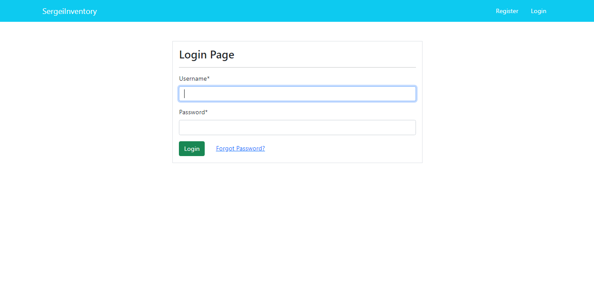
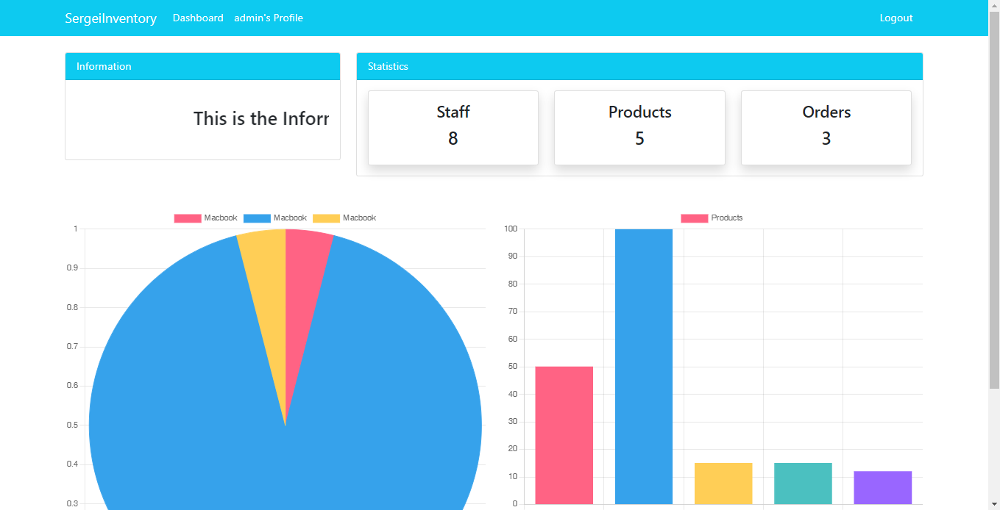
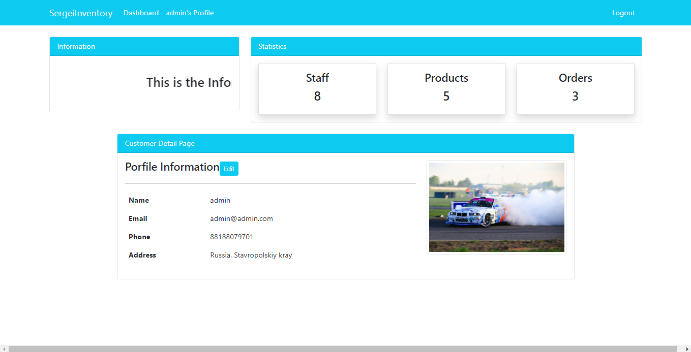

# SimpleIMS

Simple inventory system, built with Django, Chart.JS






```
cd inventoryproject/
python manage.py makemigrations
python manage.py migrate
python manage.py createsuperuser
python manage.py runserver
```